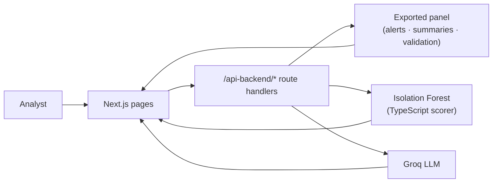

<p align="center">
  
</p>

<h1 align="center">Corporate Signal Intelligence Dashboard</h1>

<p align="center">
  <strong>Next.js · TypeScript · Tailwind · Recharts · Groq briefings</strong><br />
  <em>Executive UI for ML anomaly detection across monitored public issuers.</em>
</p>

<p align="center">
  <a href="https://github.com/sidnei-almeida/corporate-signal-intelligence-dashboard"><strong>View on GitHub</strong></a>
  &nbsp;·&nbsp;
  <a href="https://github.com/sidnei-almeida/corporate-signal-intelligence">Research repo (pipelines &amp; notebooks)</a>
</p>

<p align="center">
  
  
  
  
  
  
  
  
</p>

---

## What this is

A **dark, glass-style executive dashboard** over the [Corporate Signal Intelligence](https://github.com/sidnei-almeida/corporate-signal-intelligence) research pipeline. It turns the conditional deviation score, the Isolation Forest reading that travels beside it, and issuer metadata into an analyst workflow: scan the universe, drill into a ticker, inspect signal drivers, and generate **Groq-powered executive memos** from a selected event.

**Everything runs inside this deployment.** The API lives in `src/app/api-backend/*` as Next.js route handlers, the trained pipeline is scored in TypeScript from an exported artifact, and the panel ships with the build. There is no model host to call, no database to reach, and nothing to keep awake.

> **Research repo:** [corporate-signal-intelligence](https://github.com/sidnei-almeida/corporate-signal-intelligence) holds the notebooks, the evaluation protocol, and the training run that produces the artifacts this dashboard embeds.

---

## Pages & workflow

| Route | Purpose |
|-------|---------|
| **Overview** `/` | KPI strip, ML pipeline status, anomaly type distribution, company risk ranking, top events preview |
| **Anomalies** `/anomalies` | Filterable event queue, selected anomaly detail, summary table |
| **Companies** `/companies` | Issuer selector, intelligence profile, signal breakdown chart, anomaly timeline |
| **AI Briefings** `/briefings` | Event context panel, one-click Groq memo generation, markdown reader + insight sidebar |



Only the briefing call leaves the deployment.

---

## Main features

### Executive overview

- **KPI cards** — monitored companies, total anomalies, average anomaly rate, highest-risk ticker, model availability
- **ML Pipeline card** — artifact status, API health pills, engine metadata, pipeline flow tags, signal stack (Stooq · SEC EDGAR · Isolation Forest · Groq)
- **Anomaly Type Distribution** — horizontal bar chart with uniform cyan → blue gradient on every bar
- **Company Risk Ranking** — top issuers by anomaly rate
- **Top anomaly events** — sortable preview table with severity and type chips

### Investigation & issuer views

- **Severity badges** — `Critical` · `High` · `Medium` · `Low` with dedicated color tokens (red / amber / green)
- **Anomaly type chips** — `Price Spike`, `Volume Spike`, `Filing Activity`, `Revenue Shift`, `Combined Signal`, and more
- **Signal metrics** — daily return, volume/return z-scores, volatility, filing counts, revenue QoQ, margins
- **Interactive timeline** — anomaly score over time; severity-colored scatter points; click to select for briefing
- **Company signal breakdown** — per-type frequency bars + signal profile metrics

### AI briefings

- Select any anomaly row or timeline point
- **Generate AI Briefing** calls `POST /briefings/generate` with structured context
- Markdown memo with risk interpretation, monitoring checklist, and evidence snapshot
- Model name and generation timestamp in the toolbar

### System indicators

- Boot screen while `/health` and `/model/info` answer (milliseconds now that both are local)
- **API Online** / **Artifact loaded** status pills with live dot pulse
- Loading and error states with retry on data hooks

---

## Design system

Built for long monitoring sessions: low-glare dark base, cyan accent, glass cards, and monospace data.

| Element | Implementation |
|---------|----------------|
| **Typography** | [Syne](https://fonts.google.com/specimen/Syne) (UI) + [JetBrains Mono](https://www.jetbrains.com/plex/mono/) (scores, tickers, tables) via `next/font` |
| **Cards** | Frosted panels — `rgba(255,255,255,0.028)` background, cyan border, `backdrop-filter: blur(12px)` |
| **Metric cells** | Subtle inner tiles — no heavy teal fills; hover brightens border only |
| **Charts (Recharts)** | Horizontal bar gradient `#00D4FF` → `#0066FF` on **all** bars; line/area charts in cyan; severity legend unchanged on timeline scatter |
| **Severity badges** | CSS classes `severity-badge-critical` / `-high` / `-moderate` — not reused for chart series colors |
| **Pipeline tags** | Cyan pill labels for steps like *Market Signals → SEC Filings → ML Score → AI Briefing* |
| **Status pills** | Green glow for healthy API / artifact states |

Tokens live in `src/app/globals.css`, `src/lib/cardVisuals.ts`, and `src/lib/chartTheme.ts`.

---

## Severity & anomaly types

Scores map to severity tiers for badges and risk labels:

| Severity | Typical use in UI |
|----------|-------------------|
| **Critical** | Lowest scores · highest priority |
| **High** | Elevated deviation |
| **Medium** / **Low** | Moderate monitoring |

Rule-based **anomaly types** (from the backend) appear as chips and chart categories, for example:

`revenue_shift` · `filing_activity` · `high_volatility` · `volume_spike` · `price_spike` · `negative_margin` · `combined_signal`

---

## Tech stack

| Layer | Choice |
|-------|--------|
| Framework | Next.js 15 (App Router) |
| Language | TypeScript |
| Styling | Tailwind CSS v4 + CSS variables |
| Charts | Recharts 3 |
| Icons | Lucide React |
| Markdown | `react-markdown` + `remark-gfm` (briefings) |
| API | Next.js route handlers in `src/app/api-backend/*` |
| Inference | Isolation Forest walked in TypeScript (`src/server/isolationForestCore.ts`) |
| Data | Build-time JSON exports in `src/data/generated/`, read by `src/server/panel.ts` |

---

## Inference in the app

The trained pipeline is `Pipeline(SimpleImputer, RobustScaler, IsolationForest)` — 300 trees over 27 features. `scripts/export_model_artifacts.py` flattens it into plain arrays (imputer medians, scaler centre and scale, split structure and per-node sample counts), and `src/server/isolationForestCore.ts` walks those arrays the way scikit-learn does.

That port is checked, not assumed:

```bash
npm run verify:model
```

It replays scikit-learn's own `score_samples`, `decision_function` and `predict` output — frozen in `scripts/fixtures/inference-parity.json` from real panel rows — through the TypeScript scorer. Current drift is `1.1e-16`, with no label mismatches.

Note which score does what. Alerts come from the **conditional deviation score**, a parameter-free rule: the largest of `return_zscore_21d`, `volume_zscore_21d` and `range_zscore_21d`. The forest supplies the **structural score**, context only — it was not validated as an early-warning signal and raises no alerts.

### Re-exporting after a retrain

Run this from the research repo's environment whenever the pipeline is retrained, then commit what it writes:

```bash
python scripts/export_model_artifacts.py --source ../corporate-signal-intelligence
npm run verify:model
```

It writes `src/data/generated/{isolation-forest,panel,alerts,anomalies,validation}.json` and refreshes the parity fixture. A Vercel build never needs Python, the joblib artifact, or the 28 MB results CSV.

---

## Environment

Create `.env.local`:

```env
GROQ_API_KEY=your-key
GROQ_MODEL=llama-3.3-70b-versatile   # optional
```

The key is read server-side only and never reaches the browser. Without it every page still works; `/briefings` returns 503 and the pipeline card reports the briefing service as not configured.

---

## Quick start

```bash
git clone https://github.com/sidnei-almeida/corporate-signal-intelligence-dashboard.git
cd corporate-signal-intelligence-dashboard

npm install
cp .env.example .env.local   # add GROQ_API_KEY to enable briefings

npm run dev
```

Open [http://localhost:3000](http://localhost:3000). No backend to start — the API is part of the app.

### Production build

```bash
npm run build
npm start
```

---

## Deploy on Vercel

1. Import this repository on [Vercel](https://vercel.com).
2. Framework preset: **Next.js**
3. Environment variable: `GROQ_API_KEY` (only needed for briefings).
4. Deploy.

Nothing else to provision. The panel and the model artifact are committed, so the deployment is self-contained and the browser only ever talks to its own origin.

---

## Repository structure

```
corporate-signal-intelligence-dashboard/
├── images/
│   └── header.png              # README hero
├── scripts/
│   ├── export_model_artifacts.py   # joblib + CSVs → src/data/generated/
│   ├── verify_model_parity.mts     # TypeScript scorer vs scikit-learn
│   └── fixtures/                   # frozen scikit-learn output
├── src/
│   ├── app/
│   │   ├── api-backend/        # The API: anomalies, companies, model, validation, briefings
│   │   └── …                   # Pages: /, /anomalies, /companies, /validation, /briefings
│   ├── server/                 # Panel queries, forest scorer, Groq client (server-only)
│   ├── data/generated/         # Committed exports: model, panel, alerts, validation
│   ├── components/
│   │   ├── layout/             # AppShell, Header, Sidebar
│   │   ├── dashboard/          # Charts, tables, memo, pipeline card
│   │   └── ui/                 # Card, Badge, Button, Select, …
│   ├── contexts/               # DashboardContext (health, model)
│   ├── hooks/                  # Data hooks per page
│   └── lib/                    # api, types, formatters, chartTheme, cardVisuals
├── README_model.md             # Style reference for this README
└── .env.example
```

---

## API surface

Served by this app under `/api-backend`, matching the contract the previous FastAPI service exposed.

| Area | Endpoints |
|------|-----------|
| System | `GET /health` |
| Companies | `GET /companies`, `GET /companies/{ticker}` |
| Anomalies | `GET /anomalies`, `/top`, `/summary`, `/types`, `/queue`, `/budget`, `/{ticker}` |
| Model | `GET /model/info`, `POST /model/predict` |
| Validation | `GET /validation/protocol`, `/artifacts`, `/detectors`, `/walk-forward`, `/attribution`, `/{artifact}` |
| Briefings | `POST /briefings/generate`, `/generate-from-record`, `GET /briefings/sample` |

`POST /model/predict` takes a `features` object with all 27 columns and returns both scores — the forest's decision function and the conditional deviation rule — computed in-process.

---

## Related repositories

| Project | Role |
|---------|------|
| [corporate-signal-intelligence](https://github.com/sidnei-almeida/corporate-signal-intelligence) | Data pipelines, model training, evaluation notebooks |
| **This repo** | Dashboard, API and inference |

---

## Disclaimer

Model scores and Groq-generated text are for **analytical monitoring and portfolio demonstration only**. They are not investment advice, legal opinions, or official SEC filing interpretations. Always validate against primary sources.

---

## License & author

**[MIT License](LICENSE)**

**Sidnei Alves de Almeida** — [@sidnei-almeida](https://github.com/sidnei-almeida)
